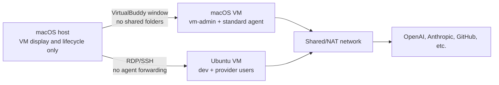

# Architecture

## Goal

Agent Devbox keeps high-capability desktop and CLI agents away from the host's
everyday files and credentials while preserving a usable graphical workflow.
It offers two independent implementations of that boundary.

## macOS profile

VirtualBuddy configures Apple's Virtualization framework and downloads the
restore image selected by the user. Apple's Setup Assistant creates the first
administrator because that step cannot be safely scripted by this project.

The host bootstrap process then:

1. connects to temporary guest SSH using a dedicated known-hosts file;
2. confirms that the remote model identifies as `VirtualMac`;
3. installs tools and desktop apps as `vm-admin`;
4. installs Codex and its configuration for the non-admin `agent` user;
5. runs guest isolation checks; and
6. offers to disable Remote Login.

Normal work happens as `agent`. `vm-admin` exists only for updates and repair.
Source code lives on the guest disk under `/Users/Shared/AgentWorkspaces`.

## Ubuntu profile

Multipass creates Ubuntu from `cloud-init.yaml.tmpl`. Cloud-init installs the
desktop, RDP server, CLI harnesses, and five Unix identities:

| Identity | Purpose |
| --- | --- |
| `dev` | Human-controlled Git and GitHub operations |
| `codex-agent` | Codex credentials and processes |
| `claude-agent` | Claude credentials and processes |
| `gemini-agent` | Gemini credentials and processes |
| `copilot-agent` | Copilot credentials and processes |

The identities share group-write access to `/workspaces` but cannot read one
another's home directories. The `dev` user can invoke fixed agent executables
as their matching identity but cannot become root. Multipass's internal
`ubuntu` user remains the administrative path.

## Data locations

| Data | Host | macOS guest | Ubuntu guest |
| --- | --- | --- | --- |
| VM disk | VirtualBuddy/Multipass library | n/a | n/a |
| Generated SSH keys and known hosts | ignored `state/` | SSH host keys | SSH host keys |
| Source repositories | none by default | `/Users/Shared/AgentWorkspaces` | `/workspaces` |
| Provider credentials | none by default | `agent` keychain/home | provider user's home |
| Generated RDP profiles | ignored `state/` | n/a | xrdp credentials are root-only |

## Design constraints

- No host-mounted working directory is part of either default profile.
- NAT is the default network. Bridged networking is explicitly out of scope.
- Account isolation and host isolation are different: a VM protects host data,
  while least-privilege provider credentials protect remote accounts.
- A rebuild must not depend on copying an existing browser, keychain, SSH, or
  cloud-credential profile from the host.
- Graphical OS installation remains manual; post-install configuration should
  be idempotent and testable.

See [Threat model](THREAT_MODEL.md) for the security boundary and
[Supply-chain policy](SUPPLY_CHAIN.md) for downloaded components.
